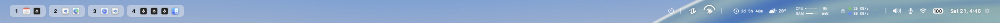
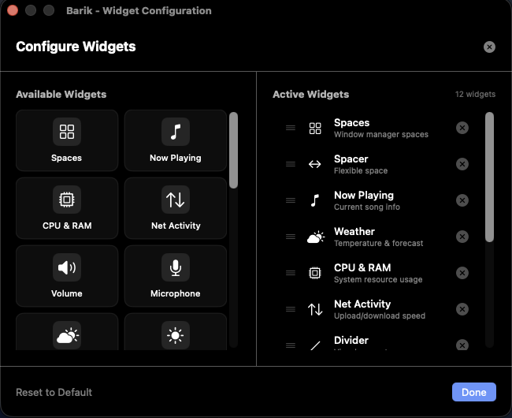
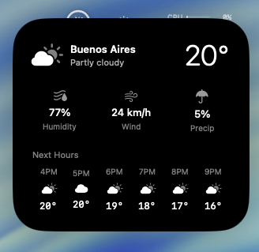
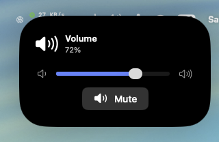
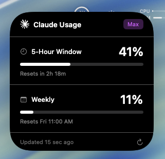

# Barik Enhanced

[](https://github.com/MateoCerquetella/barik-enhanced/releases/tag/v1.2.6)
[](LICENSE)
[](https://github.com/MateoCerquetella/barik-enhanced)

A custom, fully configurable menu bar for macOS. Built on top of [Barik](https://github.com/mocki-toki/barik) with new widgets, drag-and-drop configuration, performance optimizations, and more.



## Features

### Drag & Drop Widget Configurator
Right-click the menu bar or click the gear icon to open the visual configurator. Drag widgets from the available panel to the active list, reorder them, or remove them. Changes apply instantly.



### 20+ Widgets

| Widget | Description |
|--------|-------------|
| **Spaces** | Window manager integration (yabai/AeroSpace) |
| **Now Playing** | Current song with album art (Spotify/Apple Music) |
| **Weather** | Live temperature and forecast via Open-Meteo (no API key) |
| **CPU & RAM** | System resource usage with color-coded alerts |
| **Network Activity** | Upload/download speed |
| **Volume** | Audio control with interactive slider popup |
| **Microphone** | Mic mute/unmute toggle |
| **Brightness** | Screen brightness control |
| **Battery** | Battery level with charging status |
| **Network** | WiFi/Ethernet connection status |
| **Time** | Date, time, and calendar popup |
| **Claude Usage** | Claude API rate limit tracking with configurable alert thresholds |
| **Codex Usage** | OpenAI Codex usage monitoring with configurable alert thresholds |
| **Pomodoro** | Focus timer with work/break cycles |
| **Disk Usage** | Storage monitor with capacity bar |
| **Uptime** | System uptime display |
| **Do Not Disturb** | macOS Focus mode toggle |
| **Countdown** | Days until a target date |
| **Keyboard Layout** | Current input source indicator |
| **Performance Mode** | System performance profile selector |

### Widget Popups

<p float="left">
  
  
  
</p>

### Settings Menu
Click the gear icon at the end of the bar to access:
- **Configure Widgets** — open the drag & drop configurator
- **Launch at Login** — start Barik Enhanced on boot
- **About** — credits and version info
- **Quit** — close the app

## Installation

### Homebrew (Recommended)
```bash
brew tap MateoCerquetella/barik-enhanced
brew install --cask barik-enhanced
```

### From Source
```bash
git clone https://github.com/MateoCerquetella/barik-enhanced.git
cd barik-enhanced
open Barik.xcodeproj
```
Build and run with Xcode (Cmd+R).

### Requirements
- macOS 14.0+
- Xcode 15+
- A window manager like [AeroSpace](https://github.com/nikitabobko/AeroSpace) or [yabai](https://github.com/koekeishiya/yabai) (optional, for Spaces widget)

## Configuration

Barik Enhanced uses a TOML config file at `~/.barik-config.toml`. Edit it manually or use the built-in widget configurator.

### Example Configuration
```toml
theme = "system" # system, light, dark

[widgets]
displayed = [
    "default.spaces",
    "spacer",
    "default.nowplaying",
    "default.weather",
    "default.cpuram",
    "default.networkactivity",
    "divider",
    "default.volume",
    "default.microphone",
    "default.network",
    "default.battery",
    "default.time"
]

[widgets.default.spaces]
space.show-key = true
window.show-title = true
window.title.max-length = 50

[widgets.default.battery]
show-percentage = true
warning-level = 30
critical-level = 10

[widgets.default.time]
format = "E d, J:mm"
calendar.format = "J:mm"
calendar.show-events = false

[widgets.default.cpuram]
show-icon = false
cpu-warning-level = 70
cpu-critical-level = 90
ram-warning-level = 70
ram-critical-level = 90

[widgets.default.claude-usage]
warning-threshold = 60
critical-threshold = 80

[widgets.default.codex-usage]
warning-threshold = 60
critical-threshold = 80

[widgets.default.pomodoro]
work-duration = 25       # minutes
short-break = 5
long-break = 15
pomodoros-before-long-break = 4
```

### Available Widget IDs
```
default.spaces          default.nowplaying      default.weather
default.cpuram          default.networkactivity  default.volume
default.microphone      default.brightness      default.network
default.battery         default.time            default.dnd
default.disk            default.uptime          default.pomodoro
default.performance     default.keyboardlayout  default.claude-usage
default.codex-usage     default.countdown       spacer
divider
```

## Performance

Barik Enhanced is optimized for minimal resource usage:
- All widget managers use the singleton pattern (one timer per manager)
- Change detection prevents unnecessary SwiftUI redraws
- Background thread polling for system metrics
- Debounced config file watching
- Runs as a daemon (no Dock icon)

## Credits

Built by [Mateo Cerquetella](https://github.com/MateoCerquetella)

Based on [Barik](https://github.com/mocki-toki/barik) by [mocki-toki](https://github.com/mocki-toki)

## License

[MIT](LICENSE)
